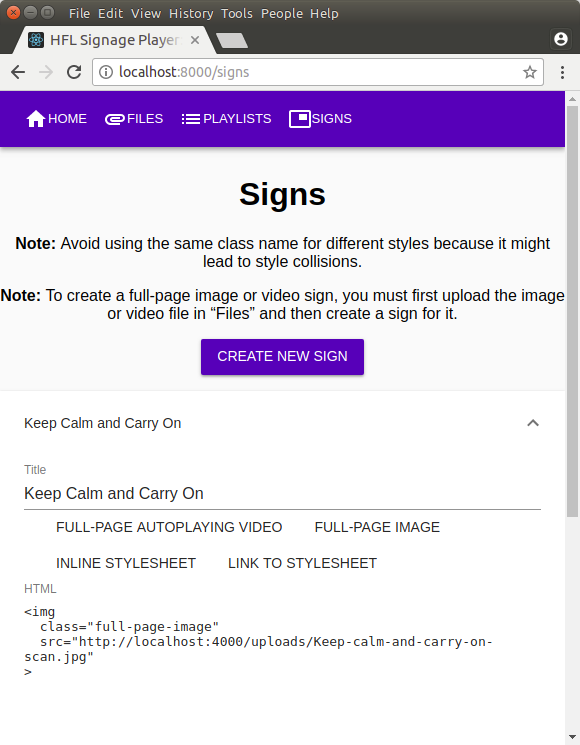
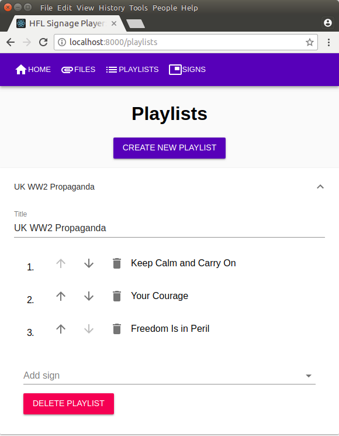
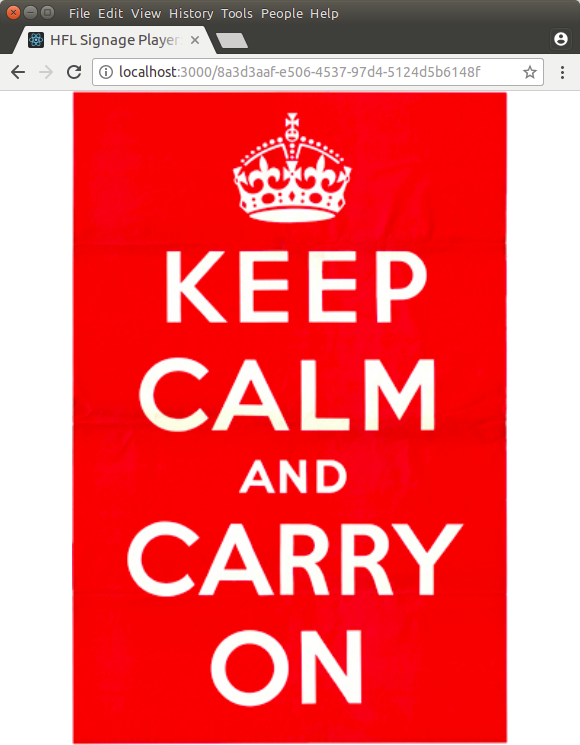

HFL Signage Player
==================

Digital signage player written by Henrik Franciscus Leppä

<table>
  <tr>
    <th scope="col">Management UI: Signs</th>
    <th scope="col">Management UI: Playlists</th>
    <th scope="col">Front-end: Playlist</th>
  </tr>
  <tr>
    <td>
      
    </td>
    <td>
      
    </td>
    <td>
      
    </td>
  </tr>
</table>

Main Technologies
-----------------

- [Express.js 4](https://expressjs.com/)
- [Material-UI v1](https://material-ui-next.com/)
- [Node.js](https://nodejs.org/)
- [PouchDB](https://pouchdb.com/)
- [React.js](https://reactjs.org/)
- [React Router 4](https://github.com/ReactTraining/react-router)
- [Redux](https://redux.js.org/)

Subprojects
-----------

This project is made up of 3 subprojects:
- [Back-end](./back-end/)
- [Front-end](./front-end/)
- [Management UI](./management-ui/)

Getting Started / Installation
------------------------------

This project is cross-platform software, and as such it should be possible to
run it on any operating system that supports the software listed in the
"Install" step, including, but not limited to: GNU/Linux, BSD, Microsoft
Windows, and macOS.

### Steps

1. Install:
   - Run-time environment:
     - Node.js 8.9.4
       - (Recommended) Install using [Node Version Manager (NVM)] (or its
         [Windows-equivalents]).
   - Web browser:
     - Mozilla Firefox (latest) \
       or
     - Chromium / Google Chrome (latest)
2. Open a command-line in the root of the project directory.
3. Run `npm install`.
4. Run `npm start`.
   - The command-line will automatically open Front-end and Management UI in
     your default browser and indicate where they can be opened in localhost and
     on your network.
   - To change the ports of the subprojects, see their documentations.
5. Go to Management UI, and create some signs, playlists, and (optionally)
   upload some files.
6. Go to Front-end, and open a playlist.

Workflow
--------

This project uses [git-flow] with default settings.

Copyright
---------

Copyright © 2018 Henrik Franciscus Leppä

All rights reserved.

[Node Version Manager (NVM)]: https://github.com/creationix/nvm
[Windows-equivalents]: https://github.com/creationix/nvm#important-notes
[git-flow]: https://github.com/nvie/gitflow
[Node.js installation]: https://nodejs.org/en/download/package-manager/#debian-and-ubuntu-based-linux-distributions
