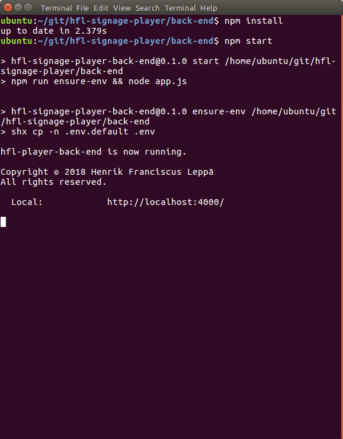
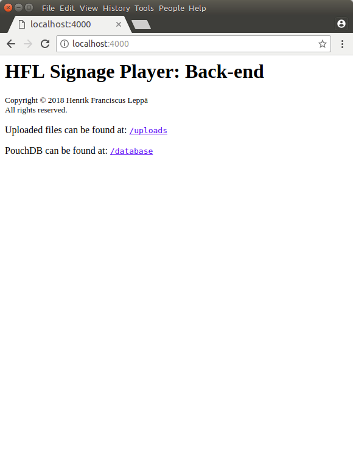
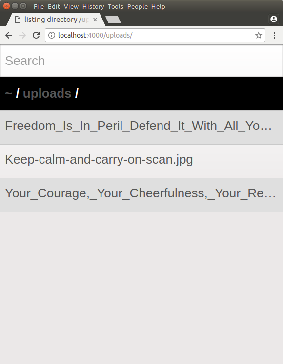

HFL Signage Player: Back-end
============================

[Express.js] back-end for [HFL Signage Player]

<table>
  <tr>
    <th scope="col">Terminal</th>
    <th scope="col">Home</th>
    <th scope="col">Uploads</th>
  </tr>
  <tr>
    <td>
      
    </td>
    <td>
      
    </td>
    <td>
      
    </td>
  </tr>
</table>

Hosts a [PouchDB] database and an upload directory.

Getting Started / Installation
------------------------------

1. Open a command-line in the root of this subproject's directory.
2. Run `npm install`.
3. Run `npm start`.
   - The command-line will show which port the server is using in localhost.
   - To change the port, change the `PORT` variable in the `.env` file that
     `npm start` creates, and restart this subproject.

     **Note:** Remember to then update `REACT_APP_BACK_END_URL` in the `.env`
     files of Front-end and Management UI!

Copyright
---------

Copyright © 2018 Henrik Franciscus Leppä

All rights reserved.

[Express.js]: https://github.com/expressjs/express
[PouchDB]: https://github.com/pouchdb/pouchdb
[HFL Signage Player]: https://github.com/henrik-leppa/hfl-signage-player
