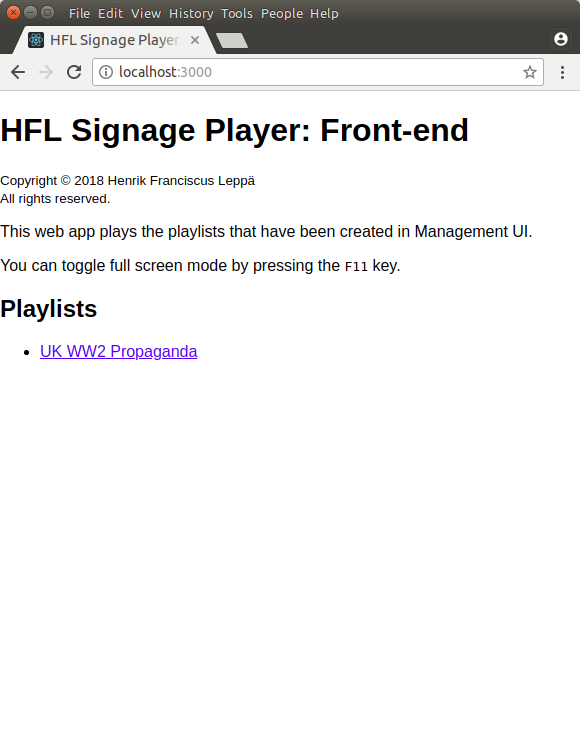

HFL Signage Player: Front-end
=============================

Front-end for [HFL Signage Player]

<table>
  <tr>
    <th scope="col">Choosing a playlist</th>
    <th scope="col">Playing a playlist</th>
  </tr>
  <tr>
    <td>
      
    </td>
    <td>
      
    </td>
  </tr>
</table>

This web app plays the playlists that have been created in [Management
UI](./management-ui/).

This app was created with [Create React App](./create-react-app.md).

Getting Started / Installation
------------------------------

1. Open a command-line in the root of this subproject's directory.
2. Run `npm install`.
3. Run `npm start`.
   - The command-line will automatically open the app in your default browser
     and indicate where it can be opened in localhost and on your network.
   - To change back-end URL from `http://localhost:4000/`, change the
     `REACT_APP_BACK_END_URL` variable in the `.env` file that `npm start`
     creates, and restart this subproject.
   - To change the port, change the `PORT` variable in the `.env` file that
     `npm start` creates, and restart this subproject.

Copyright
---------

Copyright © 2018 Henrik Franciscus Leppä

All rights reserved.

[HFL Signage Player]: https://github.com/henrik-leppa/hfl-signage-player
