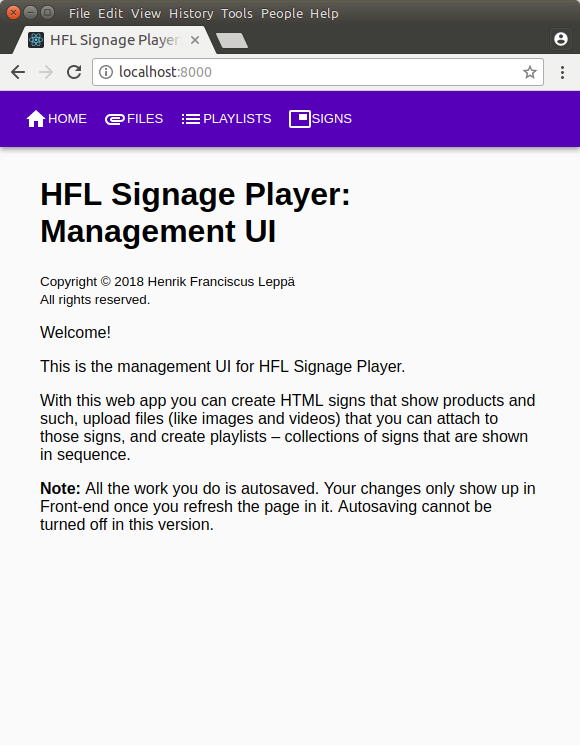

HFL Signage Player: Management UI
=================================

Management UI for [HFL Signage Player]

<table>
  <tr>
    <th scope="col">Front page</th>
    <th scope="col">Creating signs</th>
    <th scope="col">Adding signs to a playlist</th>
  </tr>
  <tr>
    <td>
      
    </td>
    <td>
      
    </td>
    <td>
      
    </td>
  </tr>
</table>

With this web app you can create HTML signs that show products and such, upload
files (like images and videos) that you can attach to those signs, and create
playlists – collections of signs that are shown in sequence.

**Note:** All the work you do is autosaved. Your changes only show up in
[Front-end](../front-end/) once you refresh the page in it. Autosaving cannot be
turned off in this version.

This app was created with [Create React App](./CREATE-REACT-APP-README.md).

[MIT License]
-------------

Getting Started / Installation
------------------------------

1. Open a command-line in the root of this subproject's directory.
2. Run `npm install`.
3. Run `npm start`.
   - The command-line will automatically open the app in your default browser
     and indicate where it can be opened in localhost and on your network.
   - To change back-end URL from `http://localhost:4000/`, change the
     `REACT_APP_BACK_END_URL` variable in the `.env` file that `npm start`
     creates, and restart this subproject.
   - To change the port, change the `PORT` variable in the `.env` file that
     `npm start` creates, and restart this subproject.

[HFL Signage Player]: https://github.com/henrik-leppa/hfl-signage-player
[MIT License]: ./LICENSE.md
